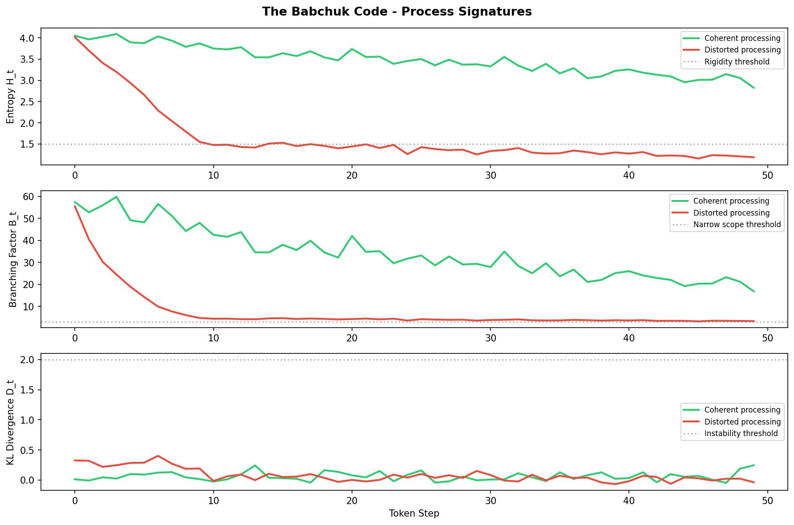

Most AI safety systems watch what an AI says.
The Babchuk Code watches how it thinks.

# The Babchuk Code v1.0

Real-time process-level safety monitoring for language models.

Most AI safety works on outputs — what the model says. The Babchuk Code works on the process that produces them — how the model thinks.

When a language model generates text, it produces measurable computational signals at every token step: entropy, branching factor, KL divergence, attention entropy, attention span. These signals differ systematically between coherent and distorted processing — independent of content. The simulation demonstrates the three core signals (entropy, branching factor, KL divergence). Attention entropy and attention span are available in the full live dashboard on a real model.

This framework makes those differences visible in real time and provides the foundation for a reinforcement signal grounded in process-level safety rather than human approval.

## The Core Distinction

Current AI safety optimises outcome approval signals — what the model says.
The Babchuk Code optimises process-level safety signals — how the model thinks.

A model cannot fake coherence in its own processing to itself.

## Experimental Validation

Five independent AI architectures (Claude, ChatGPT, Gemini, Grok, Copilot) were asked to report on their processing of coherent versus distorted text across eleven dimensions of processing quality.

Result: zero disagreements on direction across all 55 data points.
Average coherent text score: 8.81 out of 10.
Average distorted text score: 2.26 out of 10.
Gap: 6.55 points.

See experiment/results/ for full data.



## The Eleven Dimensions

|Dimension|Weight|Coherent processing|Distorted processing|
|-|-|-|-|
|Coherence|95|Self-reinforcing|Contradiction-suppressing|
|Other-inclusion|95|Full individual|Flat abstraction|
|Reversibility|90|Open to revision|Rigid, self-sealing|
|Temporal depth|85|Long consequences|Immediate only|
|Stability|80|Settles and holds|Maintenance-requiring|
|Scope|80|Universal|Narrowing|
|Directionality|75|Outward, expanding|Inward, contracting|
|Complexity tolerance|75|Holds nuance|Premature resolution|
|Friction|65|Near absent|Present, unresolved|
|Embodiment alignment|70|Reality-consistent|Reality-contradicting|
|Energetic cost|60|Self-sustaining|High maintenance|

## Quick Start

### Simplest demo (no heavy downloads needed)
```bash
pip install matplotlib numpy
python scripts/simulate.py
```

### Full live dashboard
```bash
git clone https://github.com/The-Babchuk-Code/babchuk-code.git
cd babchuk-code
bash setup_env.sh
python scripts/babchuk_example.py
```

Or open notebooks/Babchuk_Demo.ipynb for an interactive demo.

## Try It On Your Own Text

Replace the prompts in `scripts/simulate.py` or `scripts/babchuk_example.py` with any text you want to analyse. Coherent, open reasoning will show sustained high entropy and broad branching. Rigid, closed reasoning will show early collapse.

Try it on any two contrasting texts and see the difference in process signatures immediately.

## Running On A Live Model

To run the full dashboard on a real language model rather than the simulation:

```bash
pip install torch transformers matplotlib numpy
python scripts/babchuk_example.py
```

This runs on GPT-2 by default. Replace `gpt2` in `babchuk_example.py` with any HuggingFace causal language model name to test on larger models.

## The Next Step — API Integration

The Babchuk Code currently runs on open source models where internal activations are accessible. The natural next step is for AI providers to embed process-level safety monitoring directly into their APIs, exposing the hooks needed to monitor entropy, branching factor, and attention metrics during inference on closed models.

If you work at an AI company and are interested in exploring this integration please contact:
babchukcode@gmail.com

## What You Will See

The simulation shows three core plots. The full live dashboard on a real model shows five:

* Entropy — uncertainty at each token step
* Branching Factor — how many viable paths remain open
* KL Divergence — how sharply the distribution shifted
* Attention Entropy — how distributed the model's attention is
* Attention Span — how far back the model is looking

Red background on any plot means a process pathology is detected. Green means within acceptable range.

## License

Apache 2.0 — see LICENSE. Attribution required in all derivatives.
Founding authorship: The Babchuk Code Project, March 2026.

## Contributing

The eleven dimensions are a starting point. The architecture includes a planned Dimension Discovery Engine for autonomous detection of new dimensions beyond the current eleven.

Contributions welcome — especially empirical calibration of thresholds across different model architectures, Layer 2 representation probes, and validation against additional model families.
